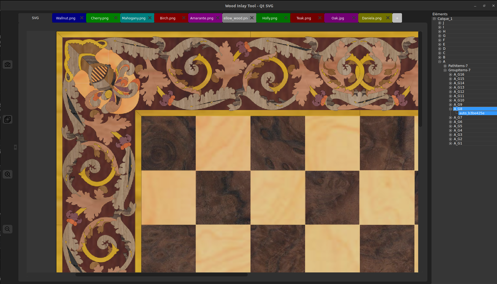

# WoodInlay

Layout software for marquetry and nesting

---

---

## Documentation Coming Soon 🚀

Full project documentation will be available very soon!
In the meantime, if you enjoy this project and want to support its development, feel free to click the **Sponsor** button above.
Every contribution, no matter how small, helps me keep improving this project. 🙏

WoodInlay is a preview tool for laser cutting projects, designed to give craftsmen, designers, and hobbyists a realistic visualization of their creations before cutting. It allows precise placement of pieces and simulates the final result by mapping the textures of the chosen materials directly onto the design.

While primarily tailored for **marquetry**, WoodInlay is versatile and can handle a wide range of laser cutting applications. The software also integrates an advanced **nesting engine**, optimizing the arrangement of parts on the material surface to minimize waste and save time.

Key features include:

- Interactive piece positioning with real-time visual feedback.

- Material texture rendering for realistic previews.

- Support for complex groups and layered designs.

- Advanced nesting and automatic optimization of parts layout.

- Designed to handle both simple and highly detailed laser-cut projects.

While primarily tailored for **marquetry**, WoodInlay is versatile and can handle a wide range of laser cutting applications. The software also integrates a **nesting engine**, optimizing the arrangement of parts on the material surface to minimize waste and save time.

## Development Status & Contributions

WoodInlay is **currently under active development**. If you are interested in collaborating on the project, I warmly invite you to **get in touch** and join the effort.

For users who would like to **report bugs** or suggest **new features**, the most effective way to get attention (especially if you cannot implement the changes yourself) is through **GitHub Sponsors**. Supporting the project financially helps prioritize requests and accelerates development, ensuring your ideas are more likely to be realized.

Your contributions—whether through code, feedback, or sponsorship-are highly appreciated and help WoodInlay grow into a more powerful and versatile tool.
